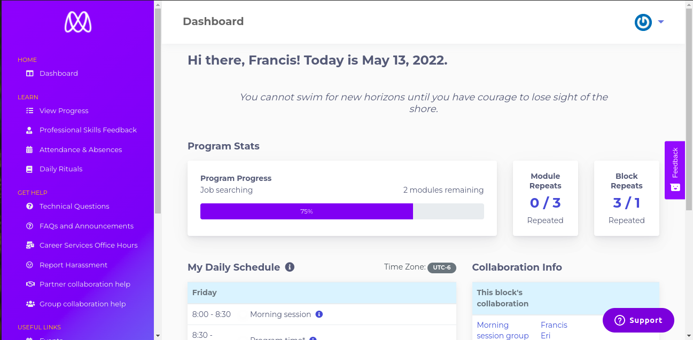
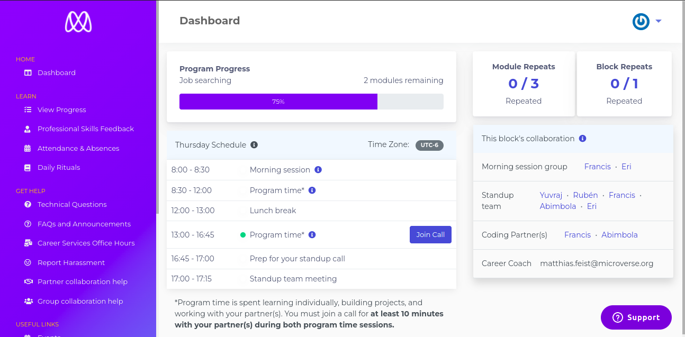

# Microverse Dashboard Enhancement.

> Ehancemenced Microverse Dashboard to assist Micronauts get the information they are looking for more efficiently.

Microverse.org

My Enhanced Version

## Changes

The most significant change I made to current dashboard was making good use of space to greatly improving cite aesthetics and usability.

1. Main section clearly shows the two column layout.
2. Removed headings to maximize space while still maintaining component function.
3. Displayed collaborators using inline style with a dot separator.
4. Resized scrollbars.
5. Made repetition stat more coherent
6. Ensured dashboard is responsive on all screen sizes.

## Built With

- JavaScript
- HTML and CSS
- Bootstrap

## Live Demo

Click [here](https://francisuloko.github.io/microverse-dashboard-enhancement) to preview Live App.

## Getting Started

To get a local copy up and running follow these simple example steps.

### Prerequisites

 - Internet and Broswer

### Setup

  - run `git clone https://francisuloko.github.io/microverse-dashboard-enhancement.git` to clone the project.

### Usage
- Open angellist-feature directory
- Open index.html in the browswer

## Authors

👤 **Francis Uloko**
- [GitHub](https://github.com/francisuloko).
- [Twitter](https://twitter.com/francisuloko).
- [LinkedIn](https://linkedin.com/in/francisuloko).

## 🤝 Contributing

Contributions, issues, and feature requests are welcome!

Feel free to check the [issues page](https://github.com/francisuloko/microverse-dashboard-enhancement/issues).

## Show your support

Give a ⭐️ if you like this project!

## Acknowledgments

[Microverse](microverse.org)

## 📝 License

This project is [MIT](./MIT.md) licensed.
